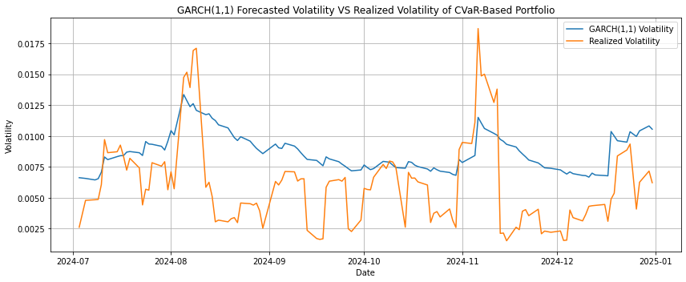
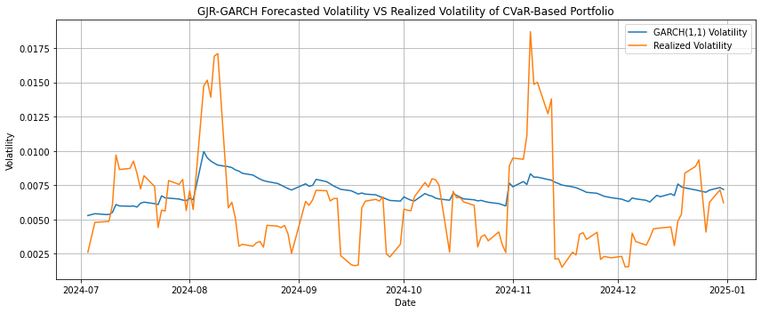

# CVAR-Portfolio-Optimization-and-Volatility-Evaluation
CVaR(Conditional Value at Risk) Minimizing Portfolio verses Max Sharpe Ratio Verses MVO portfolio. Check risk metrics with VaR, ES and GARCH modeling. Moreover, conducted volatility forecasting.

### Data
The portfolio consist of 12 major U.S. equities with defensive and diversifying assets such as cash, short-duration Treasuries, and gold.

* All data is from Yahoo Finance.
* Data Period: 2020-01-01 - 2025-01-01

## CVaR Methodology

### CVaR-Based Portfolio Optimization (Linear Programming)
* Construct a portfolio that minimizes Conditional Value-at-Risk (CVaR) at the 95% confidence level.
* Focus on downside tail risk.

### Framework
* Define portfolio losses as the negative of asset returns.
* Use the Rockafellar–Uryasev linear programming formulation of CVaR.
* Estimate one-shot CVaR optimization using the full empirical distribution of daily returns (no parametric assumptions).
* Portfolio weights are optimized ex ante based on historical tail behavior.

### Constraints
Asset-level weight bounds (Long-only portfolio)
* Core mega-cap stocks (e.g., AAPL, MSFT): Min 2%, Max 20%
* High-volatility growth stocks (e.g., NVDA, TSLA): Max 15%
* Large-cap growth stocks (e.g., GOOGL, AMZN, META, AVGO): Max 18%
* Financial stocks: cMax 15%
* Cash, short-duration Treasuries, and gold: Max 5%
* others : Max 15%

### Weekly Rebalancing CVaR Strategy (26-Week Lookback, Daily Return)
* This section implements a weekly rebalanced CVaR-minimizing strategy.
* This produces a daily return series for a strategy whose weights are updated weekly.
* At each rebalance date (Friday), the model:
    * estimates CVaR-minimizing weights using the past 26 weeks of daily returns, 
    * applies those weights to construct the next week’s portfolio returns on a daily basis (i.e., daily return within the week).
* Weights update weekly, but returns are measured daily.
 
 
**Why Weekly?**
   
* More precise volatility / drawdown behavior analysis,
* better alignment with daily risk reporting.

#### Result

| CVaR-Min              | Value      |
| --------------------- | ---------- |
| Annualized Return     | **20.32%** |
| Annualized Volatility | **13.64%** |
| Sharpe Ratio          | **1.49**   |
| VaR (95%)             | **1.36%**  |
| CVaR / ES (95%)       | **1.90%**  |

## Calculate ES shares

### Marginal ES
* measures how much the portfolio’s Expected Shortfall would change if the weight of an asset were increased infinitesimally.
* captures the tail riskiness of an asset itself, independent of its current portfolio weight.
* reflects sensitivity

### Component ES
* measures how much of the portfolio’s Expected Shortfall is actually contributed by each asset.
* incorporates both the asset’s tail behavior and its portfolio weight

| Asset     | Mean Weight | Marginal ES | Component ES   | Component ES (Proxy) | ES Share     |
| --------- | ----------- | ----------- | -------------- | -------------------- | ------------ |
| NVDA      | 0.006123    | 0.043824    | 0.000282       | 0.000268             | 0.014820     |
| AAPL      | 0.062246    | 0.029019    | 0.001785       | 0.001806             | 0.093965     |
| MSFT      | 0.077158    | 0.030850    | 0.002463       | 0.002380             | 0.129656     |
| GOOGL     | 0.045404    | 0.030960    | 0.001466       | 0.001406             | 0.077157     |
| AMZN      | 0.053456    | 0.035819    | 0.001901       | 0.001915             | 0.100076     |
| META      | 0.016018    | 0.033002    | 0.000506       | 0.000529             | 0.026650     |
| AVGO      | 0.052246    | 0.026837    | 0.001661       | 0.001402             | 0.087437     |
| TSLA      | 0.008246    | 0.042111    | 0.000336       | 0.000347             | 0.017678     |
| BRK-B     | 0.150000    | 0.016045    | 0.002407       | 0.002407             | 0.126678     |
| JPM       | 0.093825    | 0.020520    | 0.002220       | 0.001925             | 0.116839     |
| UNH       | 0.135351    | 0.016169    | 0.002237       | 0.002188             | 0.117756     |
| JNJ       | 0.150000    | 0.010222    | 0.001533       | 0.001533             | 0.080708     |
| BIL       | 0.050000    | -0.000029   | -0.000001      | -0.000001            | -0.000076    |
| SHV       | 0.050000    | 0.000017    | 0.000001       | 0.000001             | 0.000046     |
| GLD       | 0.050000    | 0.004031    | 0.000202       | 0.000202             | 0.010608     |
| **Total** |             |             | **0.01899867** |                      | **1.000000** |

## Compare the result with Max-Sharpe Portfolio
Same Framework except for the objective function.

| Max-Shape             | Value      |
| --------------------- | ---------- |
| Annualized Return     | **26.33%** |
| Annualized Volatility | **18.98%** |
| Sharpe Ratio          | **1.39**   |
| VaR (95%)             | **1.84%**  |
| CVaR / ES (95%)       | **2.67%**  |

## Calculate risk with GARCH(1,1)

## Volatility Forcasting

### Forecasting with GARCH

### Forecasting with GJR-GARCH

### Forecasting with SVR-GARCH

